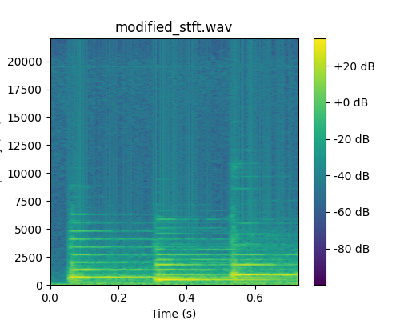

# phase-audibility

Inspired by [this discussion](http://www.silcom.com/~aludwig/Phase_audibility.htm)
I have been investigating the extent to which the human auditory system is sensitive 
to changes in the relative phase of harmonic components of sound.

An short [sound clip](original_stereo.wav) included in this repository which contains 
three piano notes, is used to explore this question.

The script [fft_modify_phase.py](fft_modify_phase.py) computes the Fast Fourier 
Transform (FFT) of the sound clip, modifies the phase by applying a random 
distortion, amd finally transforms the signal back to the time domain using 
an Inverse FFT. The modified sound clip produced by these steps is audibly 
different from the original sound clip. However, the magnitude spectrograms also 
differ substantially, as can be seen in the two figures below, created with the 
[view_spec.py](view_spec.py) script.

This leads to an interesting question: Is the human auditory sensitive to 
changes in the relative phase that leave the magnitude spectrogram invariant? 

The script [stft_modify_phase.py](stft_modify_phase.py) explores this question
as follows: First, we compute a spectrogram representation of the sound that 
optimally resolves the various frequency components and tonal changes. 
Second, we apply random distortion to the phase matrix. Finally, we use the 
Griffin-Lim algorithm to estimate the waveform from the magnitude and phase 
matrices. For comparison, we also repeat steps one and three, but omit the 
phase distortion step.

When the sound clips obtained in this manner are compared aurally they sound 
similar, if not identical, at least to my untrained ear. However, when I asked 
a professional musician to listen to the two sound clips they were able to detect 
a very slight change. 

The magnitude spectrograms of the two sound clips are shown below; they are 
essentially identical.

## Requirements

To run the Python scripts, you will need: numpy, matplotlib, soundfile, and ketos.
