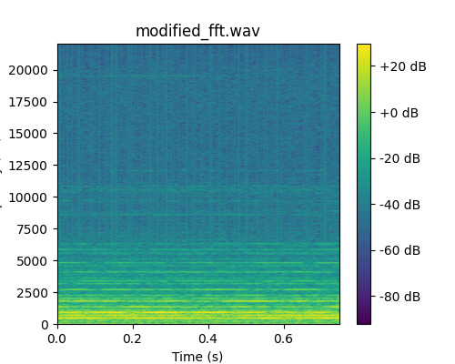

# phase-audibility

Inspired by [this discussion](http://www.silcom.com/~aludwig/Phase_audibility.htm)
I have been investigating the extent to which the human auditory system is sensitive 
to changes in the relative phase of harmonic components of sound.

An short [sound clip](original_stereo.wav) included in this repository which contains 
three piano notes, is used to explore this question.

The script [fft_modify_phase.py](fft_modify_phase.py) computes the Fast Fourier 
Transform (FFT) of the sound clip, modifies the phase by applying a random 
distortion, amd finally transforms the signal back to the time domain using 
an Inverse FFT. The modified sound clip produced by these steps is audibly 
different from the original sound clip, but the magnitude spectrograms also 
differ substantially, as can be verified using [view_spec.py] script.

The more interesting question is: Is the human auditory sensitive to changes in 
the relative phase that leave the magnitude spectrogram invariant? 

The script [stft_modify_phase.py](stft_modify_phase.py) explores this question
through the following steps: First, we compute a spectrogram representation 
of the sound clip that optimally resolves the various frequency components 
and tonal changes in the sound. Second, we apply random distortion to the 
phase matrix. Finally, we 
